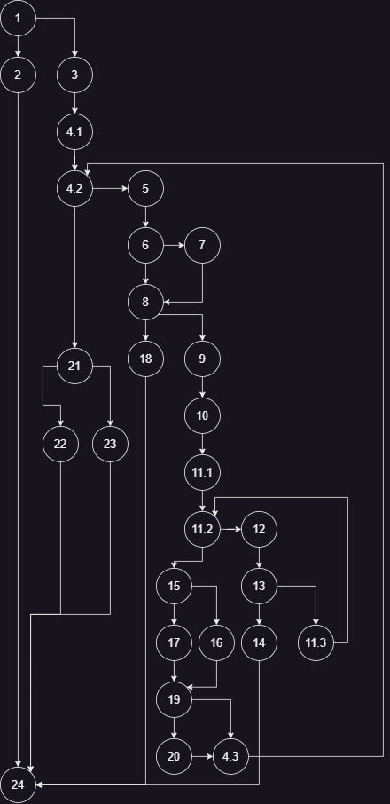
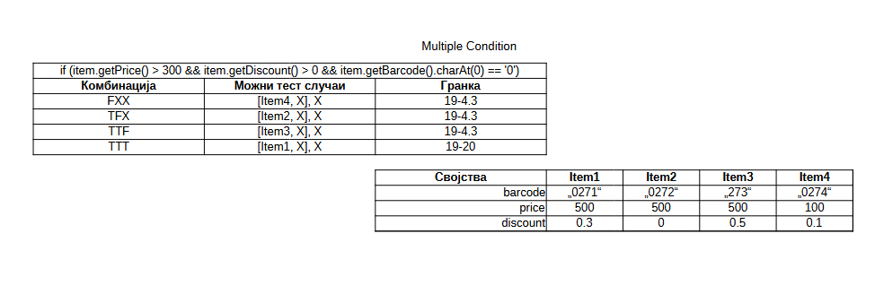

# Благоја Каракашев, 226061
____

### CFG на функцијата checkCart:
(Линиите во функцијата во датотеката [SILab2.java](src/main/java/SILab2.java) се соодветно обележени)

### Цикломатската комплексност:
Цикломатската комплексност на функцијата е еднаква со бројот на региони во control flow графот. Бројот на региони може да се добие користејќи ја Ојлеровата формула, односно: 

**R = E - V + 2**, каде што:
- E - број на ребра
- V - број на темиња, односно јазли

Користејќи ја формулата, добиваме број на региони R = 36 - 28 + 2 = 10, односно цикломатската комплексност на функцијата checkCart.

Друг начин за добивање на цикломатската комплексност на функцијата е со формулата **P + 1**, каде што P е бројот на предикатни јазли во графот. \
Предикатните јазли во графот се оние јазли кои имаат 2 или повеќе ребра насочени кон други јазли, и тие се:

1, 4.2, 21, 6, 8, 11.2, 13, 15 и 19.

Користејќи ја формулата добиваме ја цикломатската комплексност на функцијата, односно 9 + 1 = 10.

### Тест случаи според критериумот Every Branch:
Во дадената слика е табела со сите тест случаи на функцијата checkCart според Every Branch критериумот, а исто така и посебна табела за објектите во тест случаите и нивните својства. \
Гранките се именувани според control flow графот и оние кои што се обоени со црвено доведуваат до фрлање exception и крај на програмата. \
Аргументите се дадени во ист редослед како и во кодот за функцијата *(List\<Item> items, int payment)*.

### Тест случаи според критериумот Multiple Condition:
Во дадената слика е табела со сите тест случаи на функцијата checkCart според Multiple Condition критериумот за if условот **if (item.getPrice() > 300 && item.getDiscount() > 0 && item.getBarcode().charAt(0)
== '0')**, а исто така и посебна табела за објектите во тест случаите и нивните својства. \
Гранките се именувани според control flow графот. \
Во тест случаите само е потребно да се разгледа листата на Item објекти, бидејќи во условот не се проверува состојбата на payment. Исто така, името на објектите не е важно за тестирањето, па затоа не е наведено во табелата за објектите. \
Параметрите за објектите кои не се важни за соодветниот тест случај се дадени произволно. X во табелата означува било која вредност или објект.

## Unit тестирање [(отвори SILab2Test.java)](src/test/java/SILab2Test.java "Кликнете овде за да отворите SILab2Test.java")
### Every Branch unit тестирање
Во оваа функција се креираат Item објектите како што се дадени во табелата, празна листа од Item објекти што ќе биде променета со секој тест случај и RuntimeException објект што ќе се користи за да потрвдиме во која линија добивме RuntimeException. \
Во функцијата за тестирање главно се користат три assert изрази: *assertTrue* и *assertFalse* за да провериме дали функцијата checkCart ќе ја врати соодветната boolean вредност или соодветната порака во случај кога функцијата фрли исклучоци, и *assertThrows* за да провериме дали checkCart ќе фрли објект од класата RuntimeException.

### Multiple Condition unit тестирање
Слично како во функцијата за Every Branch тестирање, се креираат Item објекти според наведените параметри во соодветната табела. \
Оттука, ги тестираме можните комбинации за дадениот if услов користејќи ги *assertTrue* и *assertFalse* изразите. \
Условот е сместен во функција што враќа true или false за читливост.